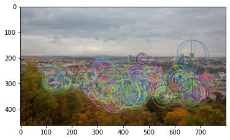
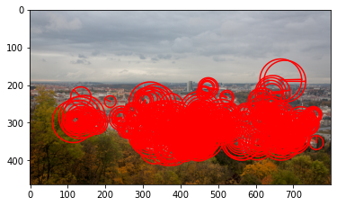
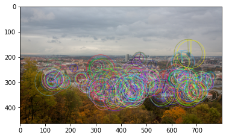

# Kornia-moons
> Helper functions for navigating the space around planet Kornia ;)


## Install

`pip install kornia_moons`

## How to use

Here is an example how to use kornia-moons for local feature conversion from OpenCV ORB keypoints

```python
%matplotlib inline
import matplotlib.pyplot as plt
import cv2
import torch
import kornia as K
from typing import List
import matplotlib.pyplot as plt

from kornia_moons.feature import *


img = cv2.cvtColor(cv2.imread('data/strahov.png'), cv2.COLOR_BGR2RGB)

det = cv2.ORB_create(500)
kps, descs = det.detectAndCompute(img, None)

out_img = cv2.drawKeypoints(img, kps, None, flags=cv2.DRAW_MATCHES_FLAGS_DRAW_RICH_KEYPOINTS)
plt.imshow(out_img)


lafs = laf_from_opencv_ORB_kpts(kps)
visualize_LAF(K.image_to_tensor(img, False), lafs, 0)

kps_back = opencv_ORB_kpts_from_laf(lafs)
out_img2 = cv2.drawKeypoints(img, kps_back, None, flags=cv2.DRAW_MATCHES_FLAGS_DRAW_RICH_KEYPOINTS)
plt.imshow(out_img2)
```

    /opt/homebrew/Caskroom/miniforge/base/envs/python38/lib/python3.8/site-packages/kornia/augmentation/augmentation.py:1830: DeprecationWarning: GaussianBlur is no longer maintained and will be removed from the future versions. Please use RandomGaussianBlur instead.
      warnings.warn(








    <matplotlib.image.AxesImage at 0x179a196d0>




